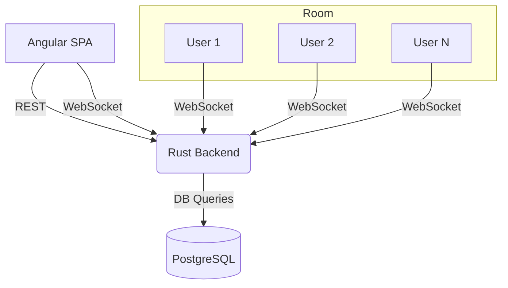

# Modern Web Architecture & WebSocket Topologies

## High-Level Architecture
- Angular SPA (frontend)
- Rust backend (REST + WebSocket)
- PostgreSQL database
- REST for CRUD, WebSocket for real-time sync

## WebSocket Topology
- Single server handles WebSocket connections
- Each whiteboard session = a "room"
- Server broadcasts updates to all clients in the same room
- Scalable to multi-server with pub/sub (e.g., Redis) in future

## Diagram (Mermaid)

---

This document defines the core architecture and WebSocket topology for the MVP.
